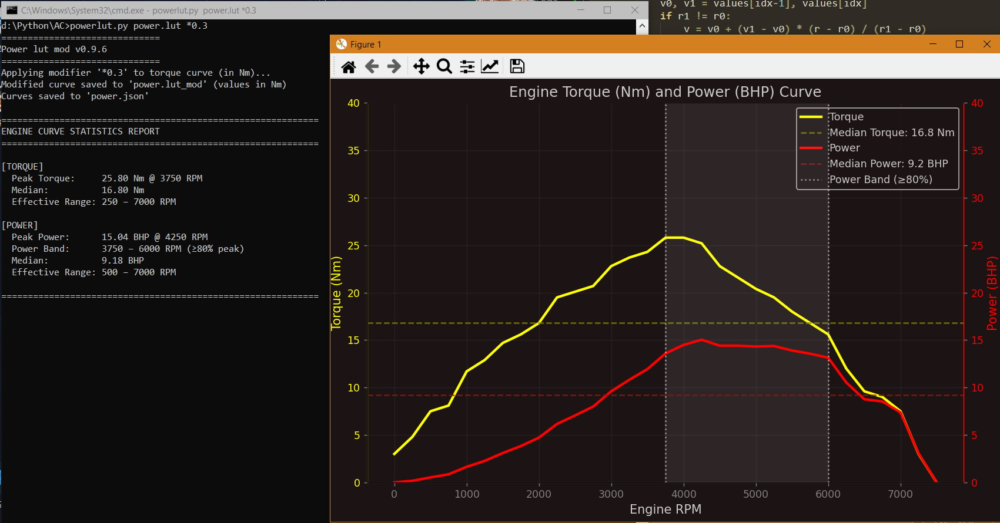

# Power Lut Mod `v0.9.6`

**Power Lut Mod** is a specialized tool for analyzing and modifying engine torque/power curves specifically for the **Assetto Corsa** engine.

## Features

* **BHP Calculation:** Automatically calculates Power (BHP) from Torque (Nm)
* **Curve Visualization:** Plots high-quality torque/power curves with detailed statistics
* **Curve Modification:** Quickly adjust values using operators (`+X`, `-X`, `*X`), e.g., `-30`, `*0.3`
* **Format Export:** Export modified curves to the `ui_car.json` and `power.lut` formats for direct game integration
* **PNG Export:** Save graphs as PNG files
* **Advanced Statistics:** Tracks peak values, median, and the specific power band
* **Verbose Mode:** Detailed console output for debugging and deep analysis

## Requirements

This tool requires Python and the `matplotlib` library for rendering:

	pip install matplotlib

## Usage

**Torque Curve Modifiers**  
Modify torque values by applying operators to the input .lut file:
`powerlut.py power.lut +10` add 10 Nm
`powerlut.py power.lut -5` subtract 5 Nm
`powerlut.py power.lut *0.75` multiply by 0.75 (-25%)

**Command Flags**

- `-png` export graph to PNG without opening GUI window  
  Example: `powerlut.py power.lut -png`

- `-v` verbose mode: enable detailed debug output  
  Example: `powerlut.py power.lut -v`
    
## Output Files

- `.json` contains 100 RPM step interpolation for the game engine
- `.lut` text output for RPM|Torque in AC format    
- `_bhp.txt` (verbose mode only) – raw text file in (RPM|Power (BHP)) format, just for fun

#### Console Output Example:
    ==============================
    ENGINE CURVE STATISTICS REPORT
    ==============================
    [TORQUE]
      Peak Torque:     46.00 Nm @ 3750 RPM
      Median:          28.00 Nm
      Effective Range: 1500 – 6000 RPM
    [POWER]
      Peak Power:      26.26 BHP @ 4250 RPM
      Power Band:      3750 – 4750 RPM (≥80% peak)
      Median:          15.31 BHP
      Effective Range: 1500 – 6000 RPM
    
**License: GPL-3.0**
    
*Made with love for the Assetto Corsa community ;)*

https://github.com/user-attachments/assets/507d5839-731f-4440-bb33-22d26affa295
